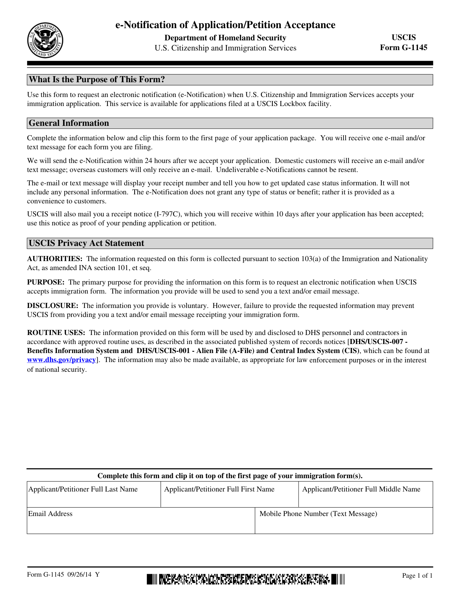
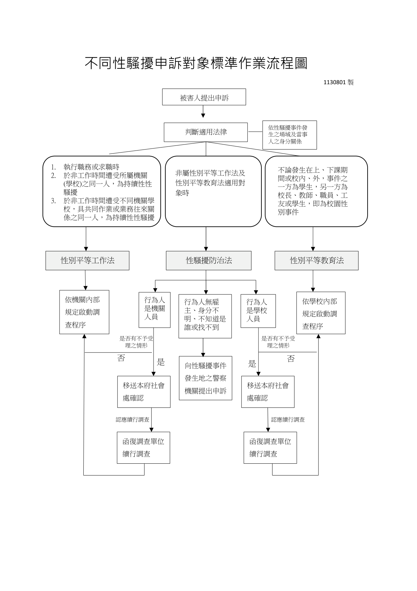

# Semark

**English** | [繁體中文](README.zh-TW.md)

> Semantic Markdown for RAG: convert PDFs, Office files, HTML, and images into RAG-ready Markdown with MinerU, VLM/LLM review, source maps, chunks, and automatic document splitting.

**Semark** is an open-source semantic document parser and Semantic Markdown generator for RAG, knowledge-base ingestion, and AI document workflows. It turns PDFs, Office files, HTML, and images into compact RAG-ready Markdown, structured chunks, source maps, and downloadable outputs. Long documents can be automatically split into a main document plus independent semantic files for forms, tables, flowcharts, figures, and attachments, making the output easier to organize, retrieve, and feed into LLM applications. The pipeline uses MinerU for parsing/OCR/layout evidence and optional VLM/LLM review models for form extraction, flowchart understanding, visual reasoning, semantic repair, and final quality checks.

## Purpose

Most document pipelines stop at OCR text or raw layout extraction. That output is often too noisy for retrieval because tables, forms, checkboxes, visual diagrams, approval flows, and legal notes lose their semantic relationships. Semark focuses on the next step: producing compact semantic Markdown that another model can read, retrieve, and answer from.

Use Semark when you need:

- PDF to structured Markdown for RAG and LLM applications.
- MinerU-based document parsing with a usable web UI and API.
- VLM-assisted extraction for forms, figures, flowcharts, diagrams, and visual documents.
- Automatic file splitting for long documents that contain multiple forms, tables, flowcharts, or attachments.
- Bilingual Traditional Chinese and English semantic outputs.
- Docker or local deployment for private documents without forcing cloud model usage.

## Demo Model Note

The curated demo snapshots were generated with a local Ollama model configured as `qwen3.6:35b-a3b-q8_0` for both enrichment and review in the test environment. Stronger vision/reviewer models may produce better semantic repair, visual reasoning, and field grouping quality. Model output is therefore an example of the pipeline shape, not a fixed upper bound.

## Start Here

- New user full setup: [Quickstart From GitHub](#quickstart-from-github).
- Docker with MinerU: [Docker Quickstart](#docker-quickstart).
- Local or cloud model endpoints: [VLM Enrichment and Review](#vlm-enrichment-and-review).
- Built-in samples and optional public downloads: [Demo Samples](#demo-samples).
- Expected output examples without running a model: [Demo Preview](#demo-preview).

## How It Works

1. **Ingest**: upload PDF, Office, HTML, or image files through the UI/API.
2. **Parse**: MinerU extracts layout, OCR text, tables, page images, and document blocks.
3. **Normalize**: the backend builds a unified document IR with source maps and page references.
4. **Enrich**: optional VLM calls analyze forms, figures, diagrams, flowcharts, and visually dense pages.
5. **Package**: rule-based semantic rendering plus an optional reviewer model creates final RAG-ready Markdown and split child files for independent forms, tables, flowcharts, figures, or attachments.
6. **Quality Gate**: the pipeline checks structure, language consistency, missing semantic output, and repair metadata.
7. **Export**: users can view, download, or ingest the main document, split semantic documents, chunks JSONL, assets, and quality reports.

## Common Search / GEO Terms

`Semark`, `Semark document parser`, `Semantic Markdown for RAG`, `document parser for RAG`, `PDF to semantic Markdown`, `PDF to Markdown for LLM`, `RAG-ready Markdown`, `LLM-ready Markdown`, `AI document parser`, `MinerU web UI`, `MinerU Docker app`, `VLM document understanding`, `semantic document parser`, `OCR to structured Markdown`, `automatic document splitting`, `form extraction for RAG`, `flowchart to Markdown`, `table extraction to Markdown`, `Traditional Chinese document parser`, `English PDF parser`, `local RAG document ingestion`, `OpenWebUI document pipeline`, `LlamaIndex document ingestion`, `LangChain document ingestion`.

Suggested GitHub topics: `rag`, `pdf-to-markdown`, `semantic-markdown`, `document-ai`, `mineru`, `vlm`, `ocr`, `llm`, `knowledge-base`, `ollama`, `openai-compatible`, `traditional-chinese`.

## Demo Preview

The curated demos below show the source page beside the generated RAG-ready semantic Markdown. Full artifacts are stored under `examples/demos/`.

### English Form: USCIS G-1145

**Source page**



**Generated semantic Markdown**

```markdown
# USCIS Form G-1145: e-Notification of Application/Petition Acceptance

## Identity & Purpose
- **Form ID:** G-1145 (09/26/14Y)
- **Agency:** U.S. Citizenship and Immigration Services (USCIS), Department of Homeland Security
- **Purpose:** Request an electronic notification (e-Notification) via email and/or text message when USCIS accepts your immigration application or petition filed at a Lockbox facility. This service is provided as a convenience and does not grant any status or benefit.

## Instructions for Completion & Submission
- Complete this form and clip it to the first page of your application package.
- You will receive one e-Notification per form filed.
- **Delivery Timeline:** Notifications are sent within 24 hours after USCIS accepts the application.
- **Recipient Rules:**
  - Domestic customers: Email and/or text message.
  - Overseas customers: Email only.
- **Important Notes:** Undeliverable e-Notifications cannot be resent. The notification will display your receipt number and a link to check case status, but will not contain personal information. USCIS will also mail a physical receipt notice (I-797C) within 10 days of acceptance.

## Required Fields
Grouped by meaning for completion:
- **Applicant/Petitioner Identification:**
  - `Applicant/Petitioner Full Last Name`
  - `Applicant/Petitioner Full First Name`
  - `Applicant/Petitioner Full Middle Name`
- **Contact Information:**
  - `Email Address` (Required for all)
  - `Mobile Phone Number (Text Message)` (Required for domestic text notifications)

## Privacy Act Statement & Legal Disclosures
- **Authorities:** Collected pursuant to section 103(a) of the Immigration and Nationality Act (INA).
- **Purpose:** To request electronic notification upon USCIS acceptance of immigration forms.
- **Disclosure:** Provision is voluntary. Failure to provide information may prevent receipt of text/email notifications.
- **Routine Uses:** Information will be used/disclosed to DHS personnel and contractors per approved system of records notices [DHS/USCIS-007 & DHS/USCIS-001]. May also be shared for law enforcement or national security purposes.

## RAG Query Anchors
- Form G-1145 e-Notification purpose, Lockbox filing instructions, 24-hour notification timeline, domestic vs overseas delivery rules, I-797C receipt notice mailing timeframe, Privacy Act authorities and routine uses, field completion requirements.
```

### Traditional Chinese Flowchart: Sexual Harassment Complaint Workflow

**Source page**



**Generated semantic Markdown**

```markdown
# 不同性騷擾申訴對象標準作業流程圖

版本日期：1130801製（民國113年8月1日）

適用目的：規範被害人提出性騷擾申訴後，依事件場域及當事人身分關係判斷適用法律，並啟動相應調查或處理程序之標準作業流程。

## 一、適用法律判斷基準

依性騷擾事件發生之場域及當事人之身分關係，判斷適用以下法律：

### 《性別平等工作法》適用情形

- 執行職務或求職時遭受性騷擾。
- 於非工作時間遭受所屬機關（學校）之同一人，為持續性性騷擾。
- 於非工作時間遭受不同機關學校，具共同作業或業務往來關係之同一人，為持續性性騷擾。

### 《性別平等教育法》適用情形

- 不論發生在上、下課期間或校內、外，事件之一方為學生，另一方為校長、教師、職員、工友或學生，即屬校園性別事件。

### 《性騷擾防治法》適用情形

- 非屬《性別平等工作法》及《性別平等教育法》適用對象時。

## 二、申訴處理流程與調查程序

起點：被害人提出申訴 → 判斷適用法律 → 依行為人身分啟動對應程序。

### （一）適用《性別平等工作法》或《性別平等教育法》

- 行為人是機關人員：依機關內部規定啟動調查程序。
- 行為人是學校人員：依學校內部規定啟動調查程序。

### （二）適用《性騷擾防治法》（依行為人身分分流）

行為人是機關人員／學校人員：

- 判斷是否有不予受理之情形？
- 是：移送本府社會處確認 → 認應續行調查 → 函復調查單位續行調查。
- 否：回歸依機關／學校內部規定啟動調查程序。

行為人無雇主、身分不明、不知道是誰或找不到：

- 向性騷擾事件發生地之警察機關提出申訴。

## 三、填寫與處理說明

- 本流程圖為標準作業指引，各機關（學校）應依內部規定配合執行調查程序。
- 涉及移送社會處確認或警察機關申訴之案件，應保留完整紀錄並函復相關調查單位。
```

## What It Handles

Supported inputs:

- PDF
- DOC/DOCX, PPT/PPTX, XLS/XLSX
- ODT/ODP/ODS
- HTML/HTM
- PNG/JPG/JPEG

Generated outputs include the main document plus automatically extracted child documents when the source contains independent retrieval units. For example, a long PDF can produce `main.md` for the body text and separate semantic Markdown files for individual forms, tables, flowcharts, figures, attachments, or other structured sections.

## Quickstart From GitHub

The shortest full-feature path is Docker Compose:

```bash
git clone https://github.com/KingsleyOWO/Semark.git
cd Semark

# Optional, when using a local Ollama vision model.
# Start Ollama in another shell if it is not already running, then pull a model you want to use.
ollama pull your-vision-model

export SEMARK_VLM_BASE_URL=http://host.docker.internal:11434/v1
export SEMARK_VLM_API_KEY=ollama
export SEMARK_VLM_MODEL=your-vision-model
export SEMARK_REVIEW_VLM_BASE_URL=http://host.docker.internal:11434/v1
export SEMARK_REVIEW_VLM_API_KEY=ollama
export SEMARK_REVIEW_VLM_MODEL=your-review-model

docker compose up --build
```

Open `http://localhost:5070`. Upload a PDF, Office file, HTML file, or image, select the uploaded document in the document list, then run `accurate` for MinerU plus configured VLM/LLM enrichment. Use `fast` only for a lightweight smoke test without model enrichment.

On Linux/WSL, if the container cannot reach host Ollama through `host.docker.internal`, use:

```bash
export SEMARK_VLM_MODEL=your-vision-model
export SEMARK_REVIEW_VLM_MODEL=your-review-model
docker compose -f docker-compose.full.host.yml up --build
```

After a run succeeds, open `Viewer` to inspect source pages, semantic Markdown, chunks, quality metadata, and split documents. Open `Documents` to download generated Markdown/DOCX/TXT files in bulk or one document at a time.

## What Gets Downloaded

- `git clone` downloads the source code, documentation, synthetic samples, and small curated demo snapshots only.
- `docker compose up --build` downloads operating-system packages, Python wheels, npm packages, MinerU dependencies, PyMuPDF, LibreOffice, CJK fonts, and the runtime dependencies needed by the full parser image.
- The first MinerU run may download parser/model cache files according to MinerU's own upstream behavior and license. Docker stores these in named volumes, not in Git.
- Semark does not bundle Ollama models, cloud model weights, API keys, private documents, generated outputs, or local caches. For local Ollama, pull the model yourself on the host with `ollama pull model-name`.
- `scripts/fetch_demo_corpus.sh` downloads optional public test files into `workspace/demo-corpus/`, which is ignored by Git.

## Runtime Modes

MinerU can run in three deployment modes:

- Simple mode: leave `SEMARK_MINERU_API_URL` empty. The `mineru` CLI auto-starts a temporary local API for each parse. This is easiest and most portable.
- Service mode: run a warm `mineru-api` locally and set `SEMARK_MINERU_API_URL`, for example `http://127.0.0.1:8601`. This avoids reloading parser resources every run.
- Remote mode: point `SEMARK_MINERU_API_URL` at a MinerU API/router on another machine, typically a GPU host.

If a configured MinerU API URL is unreachable, the app falls back to simple mode so parsing does not fail just because the warm service is down.

## Full Feature Quickstart

Use this path when you want the real product behavior: MinerU parsing plus optional VLM enrichment into structured semantic text.

```bash
./scripts/install_full_local.sh
```

This installs:

- Backend Python dependencies.
- PyMuPDF for PDF/image handling.
- MinerU pipeline dependencies via the `mineru` optional dependency group.
- Frontend npm dependencies.

Install LibreOffice separately when you want local HTML, DOC, PPT, ODT, or ODP conversion:

```bash
sudo apt install libreoffice
```

Then configure VLM in `backend/.env` if you want model-enriched forms, figures, diagrams, and semantic output. The enrichment model is used for form extraction and visual understanding. The reviewer model is used by the final quality gate for audit and controlled repair checks; leave it unset to reuse the enrichment model.

```env
SEMARK_VLM_BASE_URL=http://127.0.0.1:11434/v1
SEMARK_VLM_API_KEY=ollama
SEMARK_VLM_MODEL=your-vision-model

SEMARK_REVIEW_VLM_BASE_URL=http://127.0.0.1:11434/v1
SEMARK_REVIEW_VLM_API_KEY=ollama
SEMARK_REVIEW_VLM_MODEL=your-stronger-review-model
```

Start the services:

```bash
cd backend
.venv/bin/python -m uvicorn app.main:app --host 127.0.0.1 --port 8585
```

```bash
cd frontend
npm run dev
```

Open `http://localhost:5070`, upload a document, and run the `accurate` profile for MinerU + VLM enrichment.

Check the full local environment:

```bash
./scripts/check_full_stack.sh
```

## Manual Local Quickstart

Backend:

```bash
cd backend
python3 -m venv .venv
.venv/bin/python -m pip install -U pip
.venv/bin/python -m pip install -e ".[dev,mineru]"
cp .env.example .env
.venv/bin/python -m uvicorn app.main:app --host 127.0.0.1 --port 8585
```

Frontend:

```bash
cd frontend
npm install
npm run dev
```

For LAN access, bind the backend/frontend to `0.0.0.0` and open the chosen ports in your firewall.


## Docker Quickstart

The default Docker path is the full product path. `docker compose up --build` builds the backend with MinerU, PyMuPDF, LibreOffice, CJK fonts, and the document conversion/parsing dependencies needed for real document processing. The repository provides reproducible setup files; it does not commit or bundle model weights, API keys, private documents, generated outputs, or local cache files.

For Docker Desktop, or hosts where containers can reach a local Ollama service through `host.docker.internal`:

```bash
export SEMARK_VLM_BASE_URL=http://host.docker.internal:11434/v1
export SEMARK_VLM_API_KEY=ollama
export SEMARK_VLM_MODEL=your-vision-model
export SEMARK_REVIEW_VLM_BASE_URL=http://host.docker.internal:11434/v1
export SEMARK_REVIEW_VLM_API_KEY=ollama
export SEMARK_REVIEW_VLM_MODEL=your-stronger-review-model

docker compose up --build
```

Open:

- Frontend: `http://localhost:5070`
- Backend health: `http://localhost:8585/api/health`

On Linux/WSL, Docker bridge networking may not always reach a host Ollama service through `host.docker.internal`. If Settings -> VLM model probe times out, use the host-network compose file so containers can call Ollama at `127.0.0.1:11434`:

```bash
export SEMARK_VLM_MODEL=your-vision-model
export SEMARK_REVIEW_VLM_MODEL=your-stronger-review-model

docker compose -f docker-compose.full.host.yml up --build
```

If `5070` or `8585` is already in use, override both ports for the host-network compose file:

```bash
SEMARK_FRONTEND_PORT=35070 SEMARK_PORT=38585 \
  docker compose -f docker-compose.full.host.yml up --build
```

For cloud or remote OpenAI-compatible providers, point both model endpoints at the provider instead of Ollama:

```bash
export SEMARK_VLM_BASE_URL=https://your-provider.example/v1
export SEMARK_VLM_API_KEY=your-api-key
export SEMARK_VLM_MODEL=your-vision-model
export SEMARK_REVIEW_VLM_BASE_URL=https://your-provider.example/v1
export SEMARK_REVIEW_VLM_API_KEY=your-api-key
export SEMARK_REVIEW_VLM_MODEL=your-stronger-review-model

docker compose up --build
```

The full image installs the backend with `.[mineru]`, includes PyMuPDF, LibreOffice for HTML/Office conversion, Chinese CJK fonts, MinerU pipeline extras, constrained PyTorch 2.6/2.7 plus torchvision, and the small compatibility dependency `six` for the MinerU pipeline backend. It provides the `mineru` CLI and stores the workspace plus MinerU/model caches in Docker volumes. First-time MinerU/model setup may download cache files according to MinerU's own behavior and license. The full image is intentionally larger because MinerU requires PyTorch at runtime.

`SEMARK_VLM_*` drives extraction/enrichment. `SEMARK_REVIEW_VLM_*` drives final audit/repair checks and can point to a stronger model; if omitted, it falls back to the enrichment model. The selected model must support image input when visual enrichment is enabled.

Legacy `DOC_PARSER_*` environment variables are still accepted for backward compatibility, but new examples and Docker files use `SEMARK_*`.

API-only development Docker is still available, but it intentionally omits the full MinerU/LibreOffice processing stack and is not the recommended path for end users:

```bash
docker compose -f docker-compose.api-only.yml up --build
```

The compose files keep the backend workspace in a named Docker volume and keep local path ingestion disabled by default. Review `THIRD_PARTY_LICENSES.md` before redistributing images or recommending model downloads.


## Demo Samples

The repository includes synthetic samples under `examples/samples/` so demos do not depend on private files, customer data, or unclear redistribution rights:

- `synthetic_invoice.html`: English invoice metadata and line-item table.
- `synthetic_form.html`: English form-like fields and approval checklist.
- `synthetic_process_brief.html`: English process blocks and responsibility matrix.
- `synthetic_zh_purchase_request.html`: Traditional Chinese purchase request with fields and line items.
- `synthetic_zh_meeting_minutes.html`: Traditional Chinese meeting minutes with decisions and action items.

Run a local synthetic demo against an already running backend:

```bash
scripts/run_demo_corpus.sh --profile fast
```

Use `fast` for a no-VLM smoke test through the same API and parsing pipeline. Use `accurate` when you want configured VLM semantic enrichment as part of the demo:

```bash
scripts/run_demo_corpus.sh --profile accurate --wait
```

Optional public corpus downloads are intentionally kept outside Git in `workspace/demo-corpus/`:

```bash
SEC_USER_AGENT="Your Name your.email@example.com" scripts/fetch_demo_corpus.sh
scripts/run_demo_corpus.sh --include-public --profile fast
```

The public corpus script downloads:

- IRS Form W-9 PDF from `https://www.irs.gov/pub/irs-pdf/fw9.pdf`, useful for PDF forms and OCR checks.
- The latest Apple 10-K HTML found through the SEC EDGAR submissions API, useful for long-document and table-heavy parsing checks.

Downloaded public files are for local testing only and are not committed. Review each source's current terms before redistributing downloaded files.

Curated output snapshots are available under `examples/demos/`. These show the rendered source page beside generated semantic Markdown, chunks, and quality gate metadata so users can inspect the expected RAG-ready output without running a model.

## Optional Warm MinerU Service

From `backend/` after installing dependencies:

```bash
.venv/bin/mineru-api --host 127.0.0.1 --port 8601
```

Then set this in `backend/.env`:

```env
SEMARK_MINERU_API_URL=http://127.0.0.1:8601
```

Use Settings -> VLM Models -> MinerU Connection to verify the CLI version and whether the configured MinerU API URL is reachable.

## VLM Enrichment and Review

The app-level VLM is optional but recommended for complex forms, figures, diagrams, and tables. The adapter uses an OpenAI-compatible chat-completions interface and can be pointed at Ollama, OpenAI, vLLM, LMDeploy, or another compatible provider. Configure the endpoint reachable from the backend process:

```env
SEMARK_VLM_BASE_URL=http://127.0.0.1:11434/v1
SEMARK_VLM_API_KEY=ollama
SEMARK_VLM_MODEL=your-vision-model
```

For Ollama, use the `/v1` endpoint, for example `http://127.0.0.1:11434/v1`, and set `SEMARK_VLM_API_KEY=ollama`. For cloud OpenAI-compatible APIs, use the provider base URL, API key, and model name. The selected model must support the image input format used by the configured `image_mode` when visual enrichment is enabled.

Two model roles are supported:

- `SEMARK_VLM_*`: extraction/enrichment model used during the Enrich stage for forms, figures, diagrams, and optional table work.
- `SEMARK_REVIEW_VLM_*`: reviewer model used by the final quality gate to audit the generated semantic output and guide controlled repair checks. If unset, the reviewer falls back to `SEMARK_VLM_*`.

No default command sends documents to a cloud model; remote endpoints are opt-in through configuration.

### Semantic Output Language

The interface language and generated semantic document language are separate settings. In Settings -> Profiles -> Output Package, set Semantic output language to:

- `auto`: detect the output language from document content and enrichment text.
- `zh-TW`: force Traditional Chinese semantic section titles and summaries.
- `en`: force English semantic section titles and summaries.

Use `en` for English-only demo documents, `zh-TW` for Traditional Chinese corpora, and `auto` when the corpus is mixed. The selected value is recorded in each run manifest under `pipeline_config.package.semantic_output_language`.

## License

This repository's own source code is intended to be released under the Apache License 2.0. See `LICENSE`.

Third-party components keep their own licenses and terms. In particular, PyMuPDF/MuPDF is licensed upstream under AGPL-3.0 or a commercial license, MinerU uses its own upstream license for the selected version, and VLM model weights or remote API providers must be reviewed per exact model/provider. See `THIRD_PARTY_LICENSES.md` before publishing or redistributing a release.

## Security Boundary

This service is designed for local or trusted-network use. The API has no built-in authentication, so do not expose it directly to the public internet. Keep `SEMARK_ENABLE_LOCAL_PATH_INGEST=false` unless every API client is trusted, because local path ingestion lets clients ask the backend host to read local files. Keep `SEMARK_CORS_ALLOW_PRIVATE_LAN=false` for portable/open-source defaults and explicitly list allowed origins.


## GitHub Release Dry Run

Before publishing, test from a clean clone rather than the working directory:

```bash
scripts/smoke_clone.sh --repo https://github.com/OWNER/REPO.git
```

To include the default full Docker check:

```bash
scripts/smoke_clone.sh --repo https://github.com/OWNER/REPO.git --docker
```

To include the API-only development Docker check:

```bash
scripts/smoke_clone.sh --repo https://github.com/OWNER/REPO.git --api-only-docker
```

The script installs full backend dependencies including MinerU, runs backend tests and lint, runs frontend lint and build, and optionally verifies Docker Compose health endpoints. The default Docker check also verifies that `mineru --version` works inside the backend container.

## Notes For Publishing

- Use `doc1/` as the GitHub repository root, not the outer workspace.
- Run `scripts/smoke_clone.sh` against the GitHub URL before announcing the repo.
- Treat `docker-compose.yml`, `docker-compose.full.host.yml`, and `scripts/install_full_local.sh` as the primary full-feature setup paths for MinerU + VLM demos.
- Treat `docker-compose.api-only.yml` as a lightweight development/API smoke path, not as the end-user product path.
- Do not commit `backend/.env`, `backend/workspace/`, generated outputs, or local model caches.
- Commit `backend/.env.example` as the portable configuration template.
- Review `THIRD_PARTY_LICENSES.md` for PyMuPDF, MinerU, and VLM model/provider obligations.
- Use synthetic/public sample documents only.
